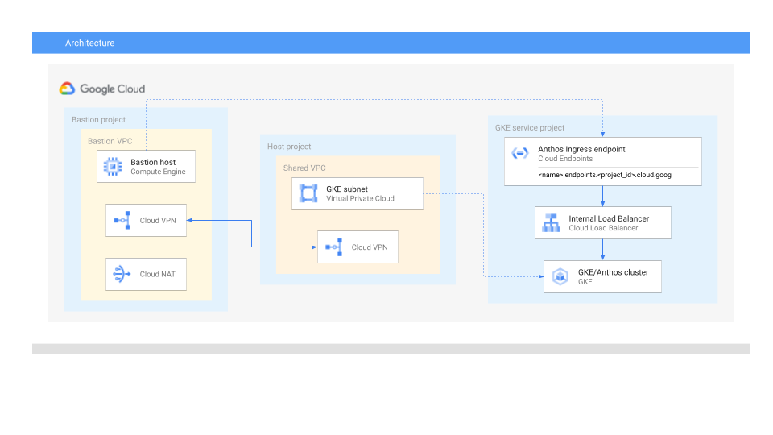

# GKE Anthos private cluster with ingress in Shared VPC

This sample creates a basic [Shared VPC](https://cloud.google.com/vpc/docs/shared-vpc) setup using one host project and 
one service project. This Shared VPC is connected through VPN to a "bastion" project which can be used to simulate 
on-prem environment or any external to Shared VPC resource.

Terraform code deploys GKE cluster with Anthos Service Mesh enabled and creates resources used by Anthos Ingress such as
self-signed HTTPS certificate, static IP address and DNS entry. Provisioning of Ingress is done using commands provided
below. In the very end there are also instructions to deploy sample application using Anthos Service Mesh to test
correctness of deployment.

Following diagram provides overview of this setup


## Provisioning Anthos Ingress

After applying terraform, run following commands:

* Get credentials for kubectl
```bash
gcloud container clusters get-credentials cluster --zone=$(terraform output -raw gke_zone) --project=$(terraform output -raw gke_project_id)
```

* (optional) Enable Cloud Tracing and Envoy access logs
```bash
cat << EOF | kubectl apply -f -
apiVersion: v1
data:
  mesh: |
    accessLogFile: /dev/stdout
    defaultConfig:
      tracing:
        stackdriver: {}
kind: ConfigMap
metadata:
  name: istio-asm-managed
  namespace: istio-system
EOF
```

* Create istio deployment 
```bash
kubectl create namespace ingressgateway
kubectl label namespace ingressgateway istio-injection- istio.io/rev=asm-managed --overwrite
kubectl apply -n ingressgateway -f https://github.com/GoogleCloudPlatform/anthos-service-mesh-packages/raw/main/samples/gateways/istio-ingressgateway/autoscalingv2/autoscaling-v2.yaml
kubectl apply -n ingressgateway -f https://github.com/GoogleCloudPlatform/anthos-service-mesh-packages/raw/main/samples/gateways/istio-ingressgateway/deployment.yaml
kubectl apply -n ingressgateway -f https://github.com/GoogleCloudPlatform/anthos-service-mesh-packages/raw/main/samples/gateways/istio-ingressgateway/pdb-v1.yaml
kubectl apply -n ingressgateway -f https://github.com/GoogleCloudPlatform/anthos-service-mesh-packages/raw/main/samples/gateways/istio-ingressgateway/role.yaml
kubectl apply -n ingressgateway -f https://github.com/GoogleCloudPlatform/anthos-service-mesh-packages/raw/main/samples/gateways/istio-ingressgateway/serviceaccount.yaml
```
 
* Create backend config for Istio ingress gateway. This configures custom health check for Istio ingress (http://:15021/healthz/ready)
```bash
cat << EOF | kubectl apply -n ingressgateway -f -
apiVersion: cloud.google.com/v1
kind: BackendConfig
metadata:
  name: ingress-backendconfig
spec:
  healthCheck:
    requestPath: /healthz/ready
    port: 15021
    type: HTTP
EOF
```

* Deploy Istio service using above backend config
```bash
cat << EOF | kubectl apply -n ingressgateway -f -
apiVersion: v1
kind: Service
metadata:
  name: istio-ingressgateway
  annotations:
      cloud.google.com/neg: '{"ingress": true}' 
      cloud.google.com/backend-config: '{"default": "ingress-backendconfig"}'
      cloud.google.com/app-protocols: '{"https":"HTTPS","http":"HTTP"}'
  labels:
    app: istio-ingressgateway
    istio: ingressgateway
spec:
  ports:
  # status-port exposes a /healthz/ready endpoint that can be used with GKE Ingress health checks
  - name: status-port
    port: 15021
    protocol: TCP
    targetPort: 15021
  # Any ports exposed in Gateway resources should be exposed here.
  - name: http
    port: 80
  - name: https
    port: 443
  selector:
    istio: ingressgateway
    app: istio-ingressgateway
  type: ClusterIP
EOF
```

* add self-signed certificate as secret to Kubernetes (Google Managed certificates are not supported on internal load balancers)
```bash
kubectl apply -n ingressgateway -f ssl-secret.yaml  
```

* deploy Istio ingress using internal load balancer and static ip provisioned in terraform.
Ingres will be exposed as Internal Load Balancer, use TLS certificate uploaded above and will not expose port 80: 
```bash
cat << EOF | kubectl apply -n ingressgateway -f -
apiVersion: networking.k8s.io/v1
kind: Ingress
metadata:
  name: gke-ingress
  annotations:
    kubernetes.io/ingress.allow-http: "false" # do not open port 80 on ILB
    kubernetes.io/ingress.global-static-ip-name: "static-ingress-ip"
    kubernetes.io/ingress.class: "gce-internal"
spec:
  tls:
  - secretName: lb-tls-certificate
  defaultBackend:
    service:
      name: istio-ingressgateway
      port:
        number: 80
EOF
```

## Deploy sample application
* Create namespace for application and label it appropriately
```bash
kubectl create namespace app 
kubectl label namespace app istio-injection=enabled istio.io/rev- --overwrite
kubectl annotate --overwrite namespace app mesh.cloud.google.com/proxy='{"managed":"true"}'
```
* Deploy sample app (hello server)
```bash
cat <<EOF | kubectl apply -n app -f - 
apiVersion: apps/v1
kind: Deployment
metadata:
  name: helloserver
spec:
  replicas: 1
  selector:
    matchLabels:
      app: helloserver
  template:
    metadata:
      labels:
        app: helloserver
    spec:
      containers:
      - image: gcr.io/google-samples/istio/helloserver:v0.0.1
        imagePullPolicy: Always
        name: main
      restartPolicy: Always
      terminationGracePeriodSeconds: 5
---
apiVersion: v1
kind: Service
metadata:
  name: helloserver
spec:
  type: ClusterIP
  selector:
    app: helloserver
  ports:
  - name: http
    port: 80
    targetPort: 8080
EOF
```

* Create a gateway and virtual service using Ingress Gateway for sample app. Gateway resource matches what
is exposed on edge Istio proxy (so on which ports Istio will listen and for which hosts), then 
[VirtualService](https://istio.io/latest/docs/reference/config/networking/virtual-service/) defines
routing on given Gateway. In this example, everything is routed to `helloserver`
```bash
cat << EOF | kubectl apply -n app -f - 
apiVersion: networking.istio.io/v1alpha3
kind: Gateway
metadata:
  name: hello-gateway
spec:
  selector:
    istio: ingressgateway
  servers:
  - port:
      number: 80
      name: http
      protocol: HTTP
    hosts:
    - "*" 
---
apiVersion: networking.istio.io/v1alpha3
kind: VirtualService
metadata:
  name: hello-ingress
spec:
  hosts:
  - "*"
  gateways:
  - hello-gateway
  http:
  - route:
    - destination:
        host: helloserver
        port:
          number: 80
EOF
```
* (optional) Enforce Mesh-wide mTLS. This affects istio-proxy to istio-proxy communication within mesh, application may 
still expose only plain http. If explicit encryption is required on the whole path remember to secure  the traffic
between Internal Load Balancer and istio-ingressgateway as described in [From edge to mesh: Exposing service mesh 
applications through GKE Ingress](https://cloud.google.com/architecture/exposing-service-mesh-apps-through-gke-ingress?hl=en#install_the_self-signed_ingress_gateway_certificate).
```bash
kubectl apply -f - <<EOF
apiVersion: "security.istio.io/v1beta1"
kind: "PeerAuthentication"
metadata:
  name: "mesh-wide"
  namespace: "istio-system"
spec:
  mtls:
    mode: STRICT
EOF
```
<!-- BEGIN TFDOC -->

## Variables

| name | description | type | required | default |
|---|---|:---:|:---:|:---:|
| [admin_user](variables.tf#L15) | Admin users for GKE | <code>list&#40;string&#41;</code> | ✓ |  |
| [billing_account_id](variables.tf#L26) | Billing account id used as default for new projects. | <code>string</code> | ✓ |  |
| [prefix](variables.tf#L90) | Prefix used for resource names. | <code>string</code> | ✓ |  |
| [root_node](variables.tf#L115) | Hierarchy node where projects will be created, 'organizations/org_id' or 'folders/folder_id'. | <code>string</code> | ✓ |  |
| [bastion_owners](variables.tf#L20) | Host VPC project owners, in IAM format. | <code>list&#40;string&#41;</code> |  | <code>&#91;&#93;</code> |
| [gke_authorized_ranges](variables.tf#L31) | Map of authorized ranges (name -> CIDR) | <code>map&#40;any&#41;</code> |  | <code>&#123;&#125;</code> |
| [gke_master_network_ranges](variables.tf#L37) | Private service IP CIDR ranges. | <code>map&#40;string&#41;</code> |  | <code title="&#123;&#10;  cluster &#61; &#34;192.168.0.0&#47;28&#34;&#10;&#125;">&#123;&#8230;&#125;</code> |
| [gke_owners](variables.tf#L45) | GKE project owners, in IAM format. | <code>list&#40;string&#41;</code> |  | <code>&#91;&#93;</code> |
| [ingress_dns_name](variables.tf#L51) | DNS name for ingress, for which record will be crated in the domain: endpoints.$${PROJECT_ID}.cloud.goog | <code>string</code> |  | <code>&#34;ingressgateway&#34;</code> |
| [ingress_static_ip](variables.tf#L57) | Static IP address for ASM Ingress | <code>string</code> |  | <code>&#34;10.0.17.100&#34;</code> |
| [ip_ranges](variables.tf#L63) | Subnet IP CIDR ranges. | <code title="object&#40;&#123;&#10;  shared-vpc &#61; string&#10;  bastion    &#61; string&#10;&#125;&#41;">object&#40;&#123;&#8230;&#125;&#41;</code> |  | <code title="&#123;&#10;  shared-vpc &#61; &#34;10.0.16.0&#47;20&#34;&#10;  bastion    &#61; &#34;10.0.32.0&#47;20&#34;&#10;&#125;">&#123;&#8230;&#125;</code> |
| [ip_secondary_ranges](variables.tf#L75) | Secondary IP CIDR ranges. | <code>map&#40;string&#41;</code> |  | <code title="&#123;&#10;  gke-pods     &#61; &#34;10.128.0.0&#47;18&#34;&#10;  gke-services &#61; &#34;172.16.0.0&#47;24&#34;&#10;&#125;">&#123;&#8230;&#125;</code> |
| [net_owners](variables.tf#L84) | Host VPC project owners, in IAM format. | <code>list&#40;string&#41;</code> |  | <code>&#91;&#93;</code> |
| [proxy_only_cidr](variables.tf#L103) | CIDR for proxy only subnet | <code>string</code> |  | <code>&#34;10.0.64.0&#47;20&#34;</code> |
| [region](variables.tf#L109) | Region used. | <code>string</code> |  | <code>&#34;europe-west2&#34;</code> |

## Outputs

| name | description | sensitive |
|---|---|:---:|
| [gke_project_id](outputs.tf#L15) | Name of the service project for GKE |  |
| [gke_zone](outputs.tf#L20) | Zone where GKE project resides |  |
| [ingress_dns](outputs.tf#L25) | DNS name of Cloud Endpoint reserved for GKE Ingress |  |
| [ingress_static_ip](outputs.tf#L30) | IP Address reserved for Internal Load Balancer |  |
| [region](outputs.tf#L35) | Region used for all resources |  |

<!-- END TFDOC -->
## References
* https://cloud.google.com/service-mesh/docs/gateways?hl=en
* https://cloud.google.com/architecture/exposing-service-mesh-apps-through-gke-ingress?hl=en
* https://cloud.google.com/service-mesh/docs/managed/provision-managed-anthos-service-mesh
